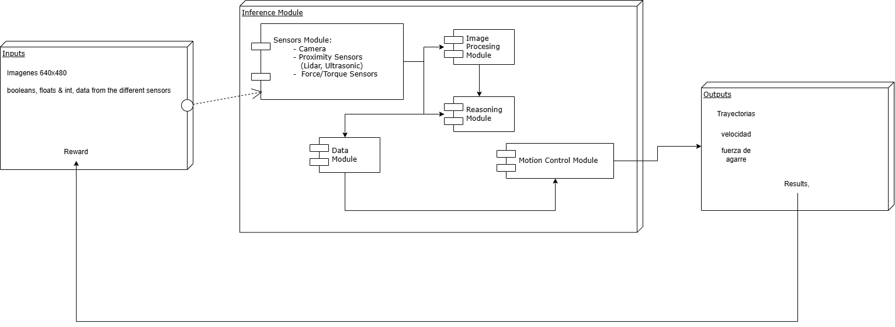
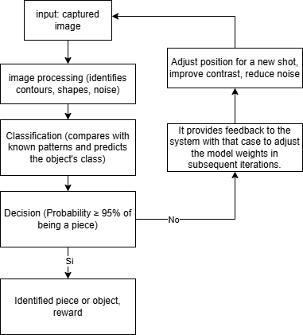
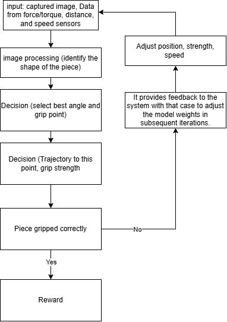
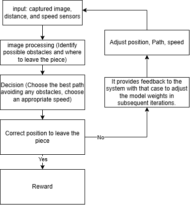
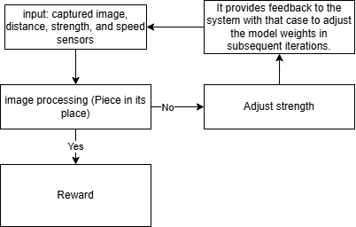

# Workshop 1

### Simulation of an autonomous and adaptive robotic arm Description
This project is about making a robotic arm that can see, recognize, and grab objects. The system has different parts. The sensor module collects information from cameras and sensors. The image processing module uses OpenCV and TensorFlow to find objects, understand their shape, and locate them.

The reasoning module helps the arm learn using reinforcement learning and OpenAI Gym, improving how it grabs objects. The motion control module moves the arm safely and adjusts the grip depending on the object. The data module saves sensor information, and feedback loops help the system improve by learning from mistakes.

With artificial intelligence and sensors, the robotic arm can adapt and become better over time. The design is modular, so new improvements can be added easily.

This will be implemented along the semester, we create a timeline where we need complete some task each week, with the purpose to finish the project in a correct way

#

### Component Diagram

#

### Feedback Loop Identify Object

#

### Feedback Loop Grap Piece

#

### Feedback Loop Transporting Part

### Feedback Loop Drop Piece

