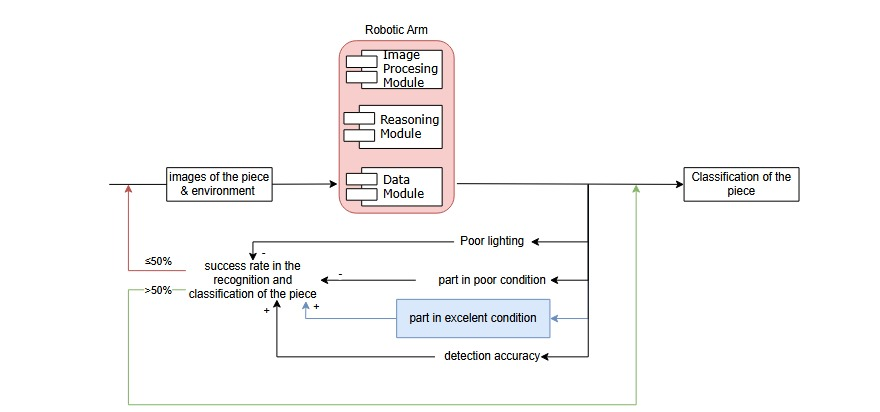

# Workshop 3

## Machine Learning Implementation

This part of the workshop is about the implementation of Machine Learning of the robotic arm, what kind of framework we will use, and how we will implement it.

We will develop an autonomous, adaptive robotic arm using image-based input processed through CNNs. To support this, we’ll use Stable-Baselines3 for implementing Deep Q-Networks (DQN) and handling reinforcement learning logic, and PyTorch for designing custom CNN architectures that extract features from camera frames and estimate Q-values. OpenAI Gym will serve as the simulation environment for the robotic arm's interactions.

This setup ensures flexibility, scalability, and efficient integration of deep learning and reinforcement learning components. We will also use Poetry for dependency management to maintain compatibility across frameworks.

## Cybernetic Feedback Integration

We will use the Cybernetic Feedback Loop to integrate the Machine Learning implementation with the robotic arm.

We create a feedback for each part of the robotic arm, and we will use the feedback to update the Machine Learning model.
 
### Identify Object Part

### Drop Piece

### Grab Piece

### Transporting Piece

### Phase Diagram Grasp

### Phase Diagram Object Recognition

### Phase Diagram transporting

### Phase Diagram Realease and Verification

## Agent Testing and Evaluation

This part of the workshop is about the testing and evaluation of the agent, we will use the test cases for the agent to test its performance.

We will begin training the robotic arm with clean, ideal images objects that are well lit, centered, and easy to recognize so it can learn the tasks without distractions. If we start with messy, real world images too soon, like ones with bad lighting or cluttered backgrounds, the robot might get confused and learn poorly. Once it’s doing well with perfect images, we will slowly introduce more realistic ones to help it handle tougher situations. For example, we won’t use an image where the apple is off center in the early training stages.

## Performance Metrics

To track the robotic arm’s learning progress, we’ll use key metrics and visualize them with graphs. The main one is the learning curve, which shows total episode rewards over time. Early on, this curve is usually noisy due to the agent exploring randomly. As training continues, we expect to see the average rewards increase, indicating that the robot is learning to perform tasks more effectively.

We’ll also look at how quickly the curve stabilizes (convergence speed) and whether it levels off at a high reward, which would mean the policy is working well. If it stays low or unstable, it could signal issues with the reward function, model, or data.

Another useful graph is the moving average reward, which smooths out noise and reveals overall trends. We may also monitor other metrics like loss and Q-values to check for overfitting or other issues. All these visualizations, created with matplotlib, will help us understand and improve the agent’s performance throughout training.

## Mono Agent

The autonomous robotic arm is treated as a single agent because all decisions and actions come from one source. It interacts with the environment, learns from its own past actions, and receives rewards without relying on other agents. While it’s possible to model each joint as a separate agent (multi-agent setup), it’s more efficient to use a single agent since all joints are controlled by one decision policy. The agent selects a joint action, and the reward is based on the overall task outcome, not on each joint individually.